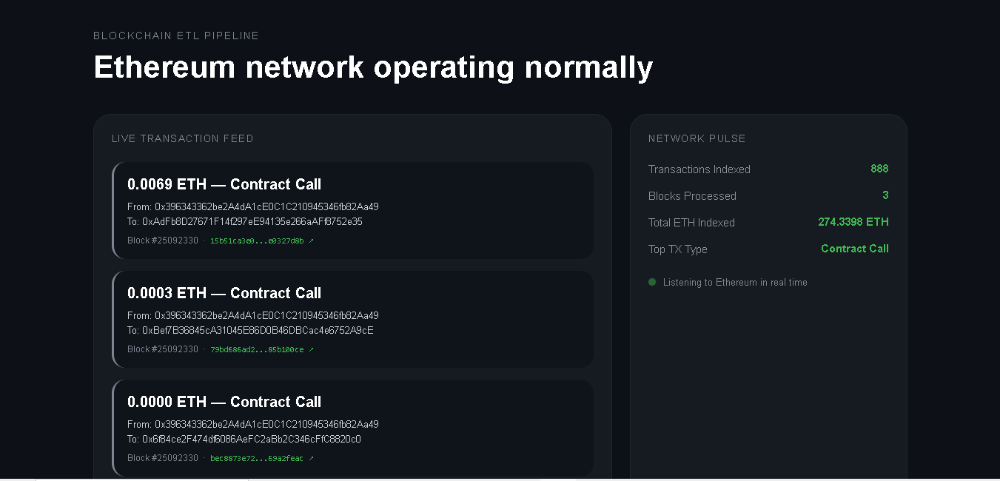

# Ethereum Blockchain ETL Pipeline

A real-time, lightweight Blockchain ETL (Extract, Transform, Load) Pipeline that continuously indexes Ethereum Mainnet blocks and raw transactions into a structured database.

## Live Demo

🔗 **Live Project:** [https://eth-etl-pipeline.onrender.com](https://eth-etl-pipeline.onrender.com)

## Problem

On-chain blockchain data is highly unstructured, nested, and distributed across millions of blocks. Querying raw data directly from an Ethereum node for analytics or accounting is slow, expensive, and inefficient. This project extracts blocks and full transactions, normalizes values, classifies operation types, and stores them into an indexed local database for rapid query execution.

## Features

- **Real-Time Extraction:** Multi-threaded worker that pools block data directly from an Ethereum RPC node every 12 seconds.
- **Data Transformation:** Converts values from Wei to Ether formats, parses inputs, and cleans hex strings.
- **Transaction Classification:** Uses heuristic method selectors to classify operations (`ETH Transfer`, `Token Transfer`, `Approve`, `Swap`, `Contract Call`).
- **Relational Storage:** Relational database mapping schemas for blocks and individual transactions.
- **Live Pulse Feed:** Frontend interface displaying rolling database statistics and a live transaction feed.

## Architecture
Ethereum Network (Mainnet)
↓  (RPC JSON-RPC Requests)
Infura Node
↓
ETL Thread Worker (Extract)
↓  (Transform & Classify)
SQLite Database (Load)
↓
Flask Web Server (API Endpoint /stats)
↓
HTML/CSS/JS Frontend Dashboard

## Stack

- **Python** — ETL process orchestration and data normalization.
- **web3.py** — Mainnet node communication protocol.
- **SQLite3** — Embedded database engine handling structured indexes.
- **Flask** — API routing framework.
- **HTML/CSS/JS** — Responsive minimal grid monitoring interface.

## Technical Decisions

- **Why SQLite over PostgreSQL for development?** SQLite removes administrative overhead and connectivity blockers during automated lightweight deployments, while preserving the exact SQL schema compatibility required for future enterprise pipeline upgrades.
- **Why Heuristic Classification instead of full ABI tracking?** Universal method selectors allow the pipeline to dynamically identify ERC-20 token transfers and DEX swaps instantly without waiting to download contract-specific source ABIs from Etherscan.

## Challenges & Learnings

- **Thread-Safe Database Writes:** Handled SQLite write lock exceptions across isolated threads by maintaining structural transaction pooling constraints.
- **Cache Persistence & Network Failures:** Implemented strict error handling and timeout sleep buffers to avoid pipeline failure or duplicate entries during RPC connection drops.

## License

MIT License
